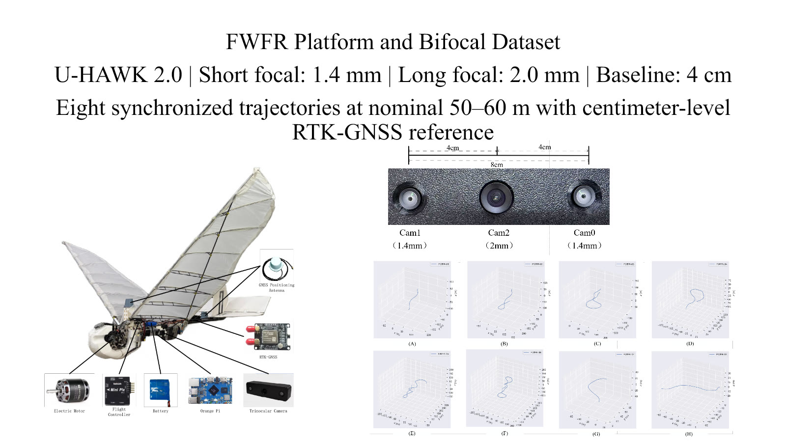
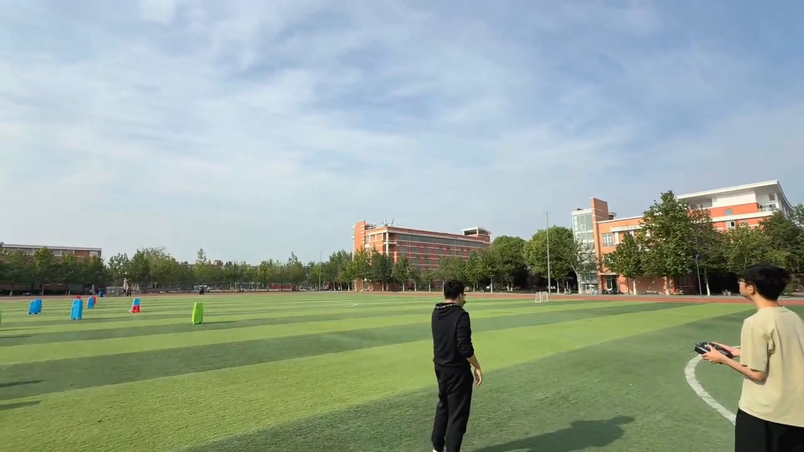
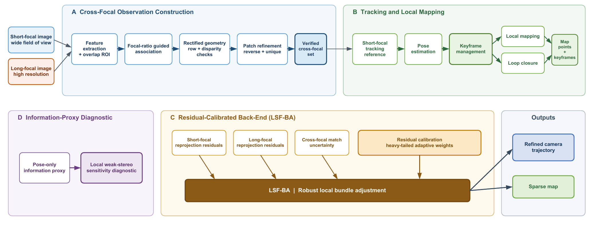
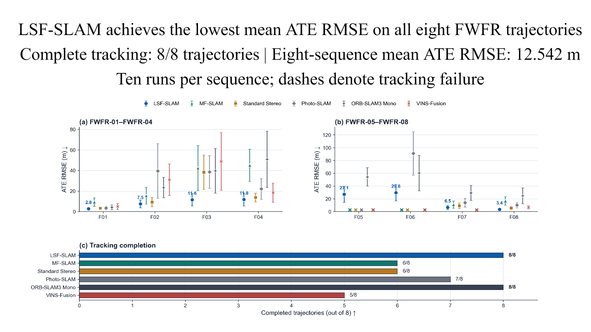

<h1>LSF-SLAM</h1>
<h3>Robust Visual SLAM for Flapping-Wing Flying Robots Based on Collaborative Bifocal-Stereo Cameras</h3>

<strong>Zheng Zhong · Shuo Chen · Qiang Fu · Xiaoyang Wu · Xulong Zhang · Wei He</strong>

  
  
  
  

  <a href="#submission-video">Submission video</a> ·
  <a href="#method-overview">Method</a> ·
  <a href="#fwfr-bifocal-dataset">Dataset</a> ·
  <a href="#downloads">Downloads</a> ·
  <a href="#citation">Citation</a>

LSF-SLAM is a robust visual SLAM framework for long-distance localization of flapping-wing flying robots (FWFRs). It combines wide-field short-focal tracking with verified long-focal observations inside a calibrated overlap, then optimizes the heterogeneous measurements using residual-calibrated LSF-BA.

> **Release status.** This repository currently provides the project page, paper figures, submission video, and dataset documentation. The dataset and camera-parameter archives are stored on Google Drive; their public download links will be added here in a later update.

  

## Submission Video

  

<strong>Preview from the 1 min 46 s submission video. The public video link will be added in a later update.</strong>

The video introduces the U-HAWK 2.0 platform, bifocal sensing configuration, cross-focal front end, residual-calibrated LSF-BA backend, benchmark results, ablations, and Jetson Orin Nano runtime.

## Method Overview

  

LSF-SLAM separates two sensing roles that conflict on a lightweight FWFR:

- **Wide-field tracking:** the 1.4 mm short-focal camera maintains full-image tracking and local mapping.
- **Long-distance detail:** the 2.0 mm long-focal camera contributes magnified observations only inside the calibrated overlap.
- **Conservative cross-focal association:** focal-ratio-guided candidates pass rectified row/disparity checks, patch refinement, reverse consistency, and one-to-one assignment.
- **Residual-calibrated optimization:** LSF-BA jointly optimizes camera-specific short- and long-focal residuals and calibrates its heavy-tailed influence model from FWFR reprojection statistics.
- **Offline interpretation:** a pose-only information proxy diagnoses the local geometric contribution of verified long-focal residuals without changing online tracking or optimization.

## Main Results

  

| Result | Value |
|---|---:|
| Tracking completion | **8 / 8 trajectories** |
| Eight-sequence mean ATE RMSE | **12.542 m** |
| Standard Stereo common-valid mean ATE RMSE | 13.272 m → **7.264 m** |
| Improvement over Standard Stereo on six common-valid sequences | **45.3%** |
| Retained front-end matches | 56.8 → **89.4 per frame** |
| Front-end inlier ratio | 42.6% → **73.7%** |
| Full system vs. front only | 17.547 m → **12.542 m** |
| Jetson Orin Nano processing speed | **13.9–19.8 FPS** |

ATE RMSE values are reported as the mean over ten runs per sequence. A missing baseline result denotes tracking failure rather than zero trajectory error.

## FWFR Bifocal Dataset

The benchmark contains eight synchronized outdoor trajectories recorded at the same site using the U-HAWK 2.0 platform. Six trajectories were collected at a nominal altitude of approximately 50 m, and two additional trajectories were collected at approximately 60 m. Centimeter-level RTK-GNSS trajectories provide the evaluation reference.

| Sequence | Nominal altitude | Flight length | Duration | Resolution |
|---|---:|---:|---:|---:|
| FWFR-01 | 50 m | 225.7 m | 20 s | 640 × 400 |
| FWFR-02 | 50 m | 345.2 m | 30 s | 640 × 400 |
| FWFR-03 | 50 m | 479.2 m | 40 s | 640 × 400 |
| FWFR-04 | 50 m | 357.3 m | 30 s | 640 × 400 |
| FWFR-05 | 50 m | 784.8 m | 60 s | 640 × 400 |
| FWFR-06 | 50 m | 959.5 m | 80 s | 640 × 400 |
| FWFR-07 | 60 m | 127.9 m | 10 s | 640 × 400 |
| FWFR-08 | 60 m | 96.6 m | 10 s | 640 × 400 |

See [docs/dataset.md](docs/dataset.md) for the platform, sensors, coordinate reference, and planned package contents.

## Sensor Configuration

| Sensor | Configuration and role |
|---|---|
| cam0 | 1.4 mm short-focal camera; full-image tracking reference |
| cam1 | 1.4 mm equal-focal camera; Standard Stereo comparison with cam0 |
| cam2 | 2.0 mm long-focal camera; verified long-distance observations |
| cam0–cam2 | 4 cm physical baseline used by LSF-SLAM |
| cam0–cam1 | 8 cm physical baseline used by Standard Stereo |
| IMU | Integrated 1 kHz inertial measurement unit |
| RTK-GNSS | Centimeter-level reference trajectories in an ENU frame |

## Downloads

Large data files are hosted outside GitHub.

| Package | Status | Link |
|---|---|---|
| Synchronized bifocal image sequences | Stored on Google Drive | **Coming soon** |
| Camera intrinsic and extrinsic parameters | Stored on Google Drive | **Coming soon** |
| RTK-GNSS reference trajectories | External archive | **Coming soon** |
| Evaluation scripts | Release preparation | **Coming soon** |

The Google Drive URL will be added to both this page and [docs/download.md](docs/download.md) once the public link is confirmed.

## Repository Contents

    LSF-SLAM/
    ├── README.md
    ├── assets/
    │   ├── framework.png
    │   ├── platform_dataset.jpg
    │   ├── benchmark_summary.png
    │   └── video_preview.jpg
    └── docs/
        ├── dataset.md
        ├── download.md
        └── release_plan.md

## Citation

The manuscript is currently under review. Final publication metadata and DOI will be added after acceptance.

    @misc{zhong2026lsfslam,
      title  = {LSF-SLAM: Robust Visual SLAM for Flapping-Wing Flying Robots
                Based on Collaborative Bifocal-Stereo Cameras},
      author = {Zhong, Zheng and Chen, Shuo and Fu, Qiang and Wu, Xiaoyang
                and Zhang, Xulong and He, Wei},
      year   = {2026},
      note   = {Manuscript under review. Project repository:
                https://github.com/asdfghjkl623/LSF-SLAM}
    }

## License

The code and dataset licenses will be specified with the public data release.

## Contact

For questions, please open a GitHub issue or contact **Qiang Fu** at [fuqiang@ustb.edu.cn](mailto:fuqiang@ustb.edu.cn).

